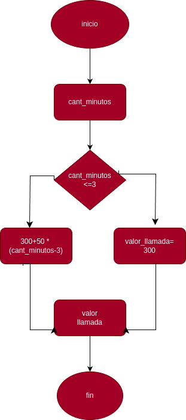

# condicionales

condicionales #1

## costo de una llamada telefonica

ingresar el tiempo de duracion de una llamada telefonica y determinar la cantidad a pagar, de acuerdo con lo siguiente
- toda llamada que dure 3 minutos o menos tiene un costo de 300 pesos
- cada minuto adicional cuesta 50 pesos
# analisis

## input 

### variable de entrada
cantidad_minutos : donde ponemos la cantidad de minutos para el pago de la llamada 

### prossesing 

cantidad_minutos >=3=300

cantidad_minutos < 3 = 300+50*(cantidad_minutos-3
# diseño

